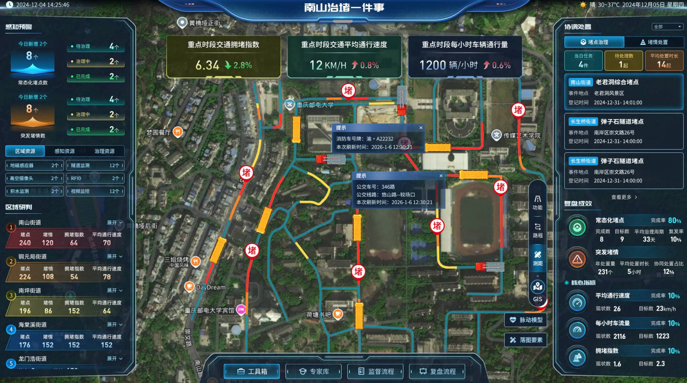

## 项目背景

针对南山片区复杂的交通拥堵痛点，项目旨在打破部门数据壁垒，以"高效处置一件事"为逻辑，构建集信号灯优化、违停监管、公交调度于一体的智慧治理体系。

## 核心职责

* **产品架构设计**：构建"一平台多终端"治理体系，集成公安交巡警、交通局、城管局等多部门数据，实现交通管理精细化。
* **业务闭环设计**：设计"问题上报—智能分拨—限时办结"的全流程机制，将治堵事项接入社区民生服务平台。

## 实施成效

* **通行效率提升**：项目上线后，主干道平均通行时间缩短 **22%**。
* **民生服务优化**：累计处理交通类民生诉求超 **1.2万件**，办结率保持在 **97%** 以上，市民满意度达 **91.5%**。
* **模式推广**：形成标准化数据接口规范，推动"南山模式"向全市范围推广应用。
