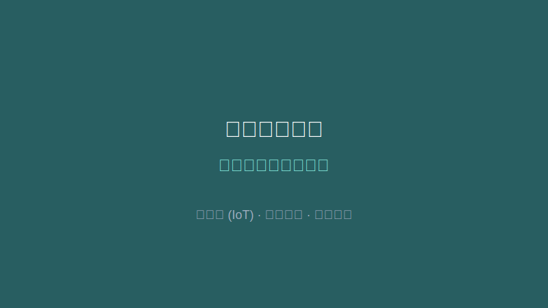

## 项目背景

针对废弃油脂（地沟油）收运过程不透明、监管难、数据孤岛等问题，构建统一的数据中心与监管平台，保障食品安全。

## 核心职责

* **全链路闭环设计**：设计"商户申报 -> 派车收运 -> 处置生产 -> 产物销售"的全生命周期管理流程。
* **监管体系构建**：引入电子联单机制取代纸质单据，结合GPS轨迹与车载视频监控，确保油脂流向可追溯。

## 实施成效

* **监管智能化**：实现了对收运车辆的实时动态监控，有效防止非法倾倒或转卖。
* **多端协同**：通过PC端、小程序端覆盖商户、司机与监管部门，打通了礼嘉大数据平台与阳光餐厨平台的数据接口。
* **社会共治**：创新性引入"扫码监督"机制，通过社会力量辅助政府监管。
